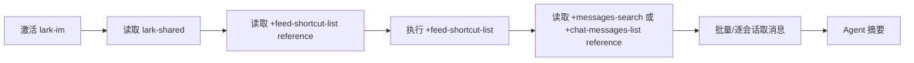
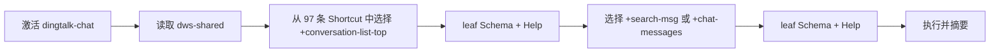
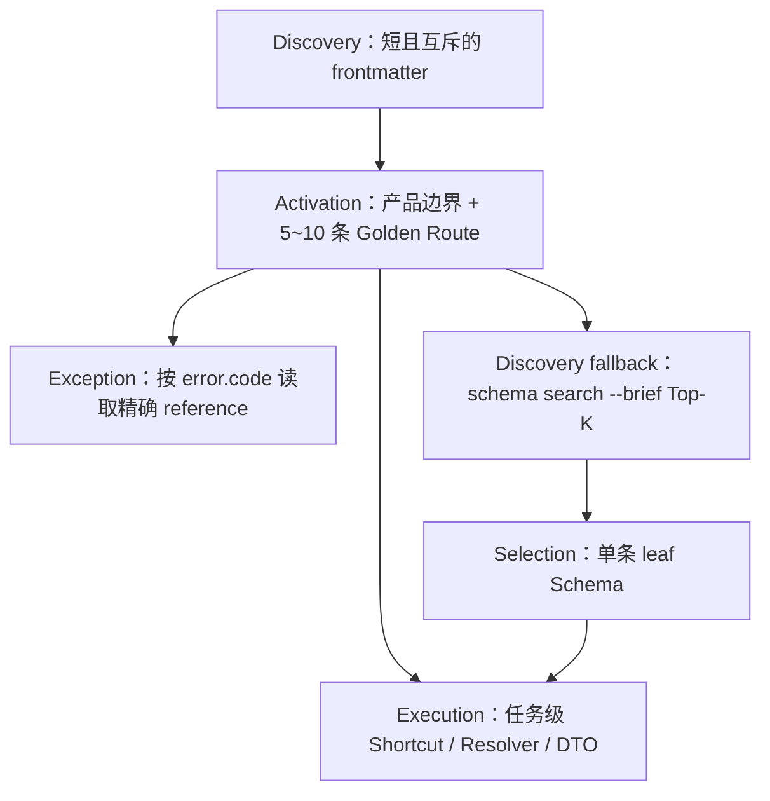

# DWS 与 lark-cli Skill 设计对比及准备阶段 Token 优化报告

> 报告元数据
>
> - 报告日期：2026-07-30
> - DWS 基线：`main@9aa76ea7`
> - 官方 Lark CLI 基线：`larksuite/cli@68a77eee5c02354a8dc2a189485a83a58664bdd5`
> - 第三方轻量 Lark CLI 基线：`yjwong/lark-cli@e15102ef6382b493afc8c89fb04e0c8f6f2e4e56`
> - Token 估算：`tiktoken 0.12.0`，`o200k_base`
> - 分析范围：Skill 激活、reference 加载、命令发现、Shortcut 编排、Schema/Help、输出 DTO、安全门禁和版本同步
> - 原始实验文档：[DWS CLI 使用体验横评](https://alidocs.dingtalk.com/i/nodes/nYMoO1rWxmP7olkyFjenAxq5V47Z3je9)

## 0. 执行摘要

本报告的核心结论是：

> DWS 在准备阶段的 Token 开销大，根因不是 DWS multi 产品 Skill 的根文件比官方 Lark 更大，而是 DWS 默认交付形态、已知任务的发现链、完整 Catalog 复制和任务编排边界共同造成的。

必须先区分两套不同的 `lark-cli`：

1. 原始实验实际使用的是官方 [`larksuite/cli`](https://github.com/larksuite/cli)，其 IM 任务由 `lark-im + lark-shared` 以及按任务拆分的 reference 驱动。
2. 仓库现有优化指导第 9 节引用的是第三方 [`yjwong/lark-cli`](https://github.com/yjwong/lark-cli)。它只有 8 个较小的产品 Skill，没有 shared Skill，命令面和安全契约也远小于 DWS。

两者都值得参考，但不能作为同一条对比基线。

### 0.1 最重要的量化结果

| 路径 | 文件/输出 | Token |
|---|---:|---:|
| 官方 Lark IM 根 Skill | `lark-im/SKILL.md` | 5,471 |
| 官方 Lark shared | `lark-shared/SKILL.md` | 2,978 |
| 官方 Lark IM 根激活合计 | product + shared | **8,449** |
| DWS multi chat 根 Skill | `dingtalk-chat/SKILL.md` | 5,790 |
| DWS multi shared | `dws-shared/SKILL.md` | 1,511 |
| DWS multi chat 根激活合计 | product + shared | **7,301** |
| DWS mono 根 Skill | `skills/mono/SKILL.md` | 8,800 |
| DWS mono chat 产品 reference | `references/products/chat.md` | 37,682 |
| DWS mono chat 基础路径合计 | root + product reference | **46,482** |
| DWS chat 完整 Shortcut 发现输出 | 97 条 | **42,624** |
| DWS chat 产品级 compact Schema | 129 个工具 | **34,169** |

因此：

- 官方 Lark 的产品根激活并不比 DWS multi 小。
- DWS multi 已经证明“按产品拆 Skill”方向有效。
- 最大异常是 DWS 稳定推荐形态仍偏向 mono，并要求充分读取整个产品 reference。
- 一旦 Agent 在已知意图下继续调用产品级 Schema 或完整 Shortcut Catalog，准备成本会再次增加数万 Token。

### 0.2 推荐的优化顺序

1. 停止把 mono 的完整产品 reference 作为清晰单产品任务的默认必读内容。
2. 删除 multi 产品根 Skill 中机械生成的完整 Shortcut 表，只保留 5～10 条经过任务评测的 Golden Route。
3. 为“置顶会话摘要”等高频复合任务提供单命令 facade/helper。
4. 已知意图直接执行；模糊意图使用 Top-K `schema search --brief`；完整产品 Schema 只用于审计和最终回退。
5. 默认输出任务级 DTO，不返回完整 API envelope；业务证据 Token 与准备阶段 Token 分开计量。
6. 保留并加强 Runtime 安全、确认门禁、参数约束和版本一致性，不通过删除安全事实换取 Token。

### 0.3 本次浅水区落地状态

已在 `codex/skill-token-shallow-water` 分支完成第一批低风险改动。范围严格限制在 Skill 文案、生成器和策略门禁，不修改 Runtime、公开 CLI、命令身份、参数契约或确认逻辑。

| 指标 | `main@9aa76ea7` | 本分支 | 变化 |
|---|---:|---:|---:|
| DWS multi chat 根 Skill | 5,790 Token | 3,260 Token | -2,530（-43.7%） |
| DWS multi chat + shared | 7,301 Token | 4,771 Token | -2,530（-34.7%） |
| DWS mono 根 Skill | 8,800 Token | 8,748 Token | -52（静态体积变化小，但移除了默认全量 reference 加载要求） |
| Schema 工具面 | 845 | 845 | 不变 |
| chat 公开 Shortcut | 97 | 97 | 不变 |

已落地内容：

1. chat 根 Skill 不再复制 97 行完整 Shortcut 表；完整能力继续由 Runtime Catalog 与 leaf Schema 交付。
2. 已知意图优先使用 Skill 的优先路由、意图表和任务 reference，完整 `shortcut list` 降为低频能力无法定位时的最后回退。
3. mono 不再要求“充分阅读产品参考文件”；已有精确 CLI path 时允许直接执行，只按不确定项补读 leaf Schema 或 Help。
4. Shortcut Skill 生成器增加 `--check`，生成内容过期时失败而不改写工作区。
5. 新增 chat 根 Skill 14,000 字节预算、禁止 97 行表回流、禁止 mono 恢复强制全量加载的策略门禁，并接入 `make policy`。

验证结果：

- `make skill-context-budget skill-command-integrity`：通过，覆盖 999 条可执行命令路径。
- `./scripts/policy/check-generated-drift.sh`：通过，两次独立生成一致。
- `DWS_PACKAGE_VERSION=0.0.0-test go test ./...`：通过。
- `go build -o /tmp/dws-codex-skill-token-build ./cmd`：通过。仓库指南中的裸 `go build ./cmd` 会因输出名 `cmd` 与现有目录同名而失败，因此验证时显式指定输出文件。

---

## 1. 问题背景与分析目标

原始横评文档的一个重要结论是：DWS 在真正执行业务请求前，准备阶段消耗的 Token 明显偏高。

这里的“准备阶段”包括：

- 识别和激活 Skill；
- 读取 shared 或产品 reference；
- 判断使用哪个命令；
- 调用 Shortcut Catalog、Schema 或 Help；
- 理解参数、身份、安全和输出格式；
- 在多个候选路径之间选择；
- 为执行拼装中间 ID 或前置查询。

本报告需要回答四个问题：

1. 官方 Lark CLI 的 Skill 设计与 DWS 有什么真实差异？
2. DWS 的 Token 成本究竟来自根 Skill、reference、Schema，还是执行编排？
3. “置顶会话摘要”这个具体任务应如何重构？
4. 如何分阶段优化，同时保持 DWS 当前的能力覆盖和安全契约？

---

## 2. 基线、术语与方法

### 2.1 三个对比对象

#### A. DWS 当前主干

- 版本：`9aa76ea7`
- Schema 产品：26
- Schema 工具：845
- 公开 Shortcut：265
- chat 工具：129
- chat Shortcut：97
- 交付形态：
  - mono：稳定/推荐；
  - multi：按产品拆分，但仍标记为 Preview。

相关实现：

- [mono 根 Skill](../skills/mono/SKILL.md)
- [multi chat Skill](../skills/multi/dingtalk-chat/SKILL.md)
- [multi shared Skill](../skills/multi/dws-shared/SKILL.md)
- [Skill 安装模式](../internal/app/skill_setup.go)
- [Shortcut 表生成器](../scripts/gen_skill_shortcut_sections.py)

#### B. 官方 larksuite/cli

- 仓库：[`larksuite/cli`](https://github.com/larksuite/cli)
- 当前分析提交：`68a77eee5c02354a8dc2a189485a83a58664bdd5`
- 顶层 Skill：27
- IM 根 Skill：
  - [`lark-im/SKILL.md`](https://github.com/larksuite/cli/blob/main/skills/lark-im/SKILL.md)
  - [`lark-shared/SKILL.md`](https://github.com/larksuite/cli/blob/main/skills/lark-shared/SKILL.md)
- IM Shortcut：21
- IM reference Markdown：58，包括消息、会话、搜索、资源、Feed、Reaction 和 Card 子参考。

#### C. yjwong/lark-cli

- 仓库：[`yjwong/lark-cli`](https://github.com/yjwong/lark-cli)
- 固定提交：`e15102ef6382b493afc8c89fb04e0c8f6f2e4e56`
- 产品 Skill：8
- 所有 Skill 合计：约 15,690 Token
- messages Skill：2,523 Token
- 没有 shared Skill，也没有与 DWS 同等级的完整 Runtime Schema 和安全元数据体系。

该项目适合作为“有限命令面、直接命令、任务 DTO”的小型参考，不适合作为 DWS 整体能力面的等规模竞争基线。

### 2.2 Token 口径

本报告使用 `o200k_base` 对 UTF-8 文本进行静态编码估算。

Token 数据用于：

- 比较不同设计的上下文规模；
- 识别机械复制或强制加载；
- 估算已知任务的规定路径下限；
- 设计回归预算。

Token 数据不等价于：

- 某个具体 Agent 宿主的最终计费；
- 宿主自动注入 Skill description 的精确成本；
- API 返回业务数据后的总任务成本；
- 模型思考或缓存命中后的实际账单。

### 2.3 三种成本必须分开

| 成本 | 定义 | 典型内容 |
|---|---|---|
| Discovery cost | Agent 决定激活哪个 Skill 的成本 | frontmatter name/description |
| Preparation cost | 选定 Skill 后，为执行任务读取和查询的上下文 | 根 Skill、shared、reference、Schema、Help |
| Evidence cost | 真正完成用户任务所必需的业务数据 | 消息正文、日程、文档内容 |

本报告重点优化 Preparation cost。

“消息摘要需要读取消息正文”属于必要 Evidence cost，不能通过把正文截断到失真来伪造 Token 优化。

---

## 3. 静态规模对比

### 3.1 根 Skill 与 reference

| 对象 | 文件数 | 字节 | Token |
|---|---:|---:|---:|
| 官方 Lark 所有顶层 Skill | 27 | 349,363 | 95,701 |
| 官方 Lark IM 根 Skill | 1 | 21,524 | 5,471 |
| 官方 Lark shared | 1 | 10,908 | 2,978 |
| 官方 Lark IM 全部 references | 58 | 273,831 | 75,698 |
| DWS 所有 multi 顶层 Skill | 20 | 161,799 | 46,592 |
| DWS multi chat 根 Skill | 1 | 19,728 | 5,790 |
| DWS multi shared | 1 | 5,556 | 1,511 |
| DWS multi chat 全部 references | 10 | 114,017 | 33,519 |
| DWS mono 根 Skill | 1 | 32,196 | 8,800 |
| DWS mono chat reference | 1 | 136,722 | 37,682 |
| yjwong 所有 Skill | 8 | 55,767 | 15,690 |
| yjwong messages Skill | 1 | 9,257 | 2,523 |

### 3.2 正确解读

这些数字说明：

1. **总树规模不代表单任务成本。**
   官方 Lark 的全部顶层 Skill 和 IM references 总量都大于 DWS multi，但正常任务只应激活一个产品 Skill 和一份相关 reference。

2. **DWS multi 根激活不是主要异常。**
   DWS multi chat + shared 为 7,301 Token，小于官方 Lark IM + shared 的 8,449 Token。

3. **DWS mono 是明显异常点。**
   mono 根 Skill 与 chat reference 合计 46,482 Token，尚未计入 leaf Schema、Help 和业务数据。

4. **拆文件只有在按需加载时才有价值。**
   reference 总量再大，只要入口能精确选择单文件，就不会全部进入常见任务。

---

## 4. Skill 架构 Diff

### 4.1 交付与激活粒度

#### 官方 Lark

官方 Lark 以产品 Skill 为默认组织方式：

```text
用户意图
  → 激活 lark-im
  → 读取 lark-shared
  → 根据 Shortcut 链接读取一个任务 reference
  → 执行
```

它没有要求 IM 任务先加载一个包含所有飞书产品的稳定 mono 根 Skill。

#### DWS

DWS 当前存在双轨：

```text
stable/recommended
  → mono
  → 根 Skill
  → “充分阅读”完整产品 reference

preview
  → multi
  → 产品 Skill
  → dws-shared
```

multi 的方向与官方 Lark 接近，但默认稳定交付仍会把清晰单产品任务导向 mono。

#### 结论

准备阶段优化的第一杠杆是激活粒度，而不是对已有长文档做逐句压缩。

### 4.2 根 Skill 的职责

#### 官方 Lark IM 根 Skill

官方 `lark-im` 根 Skill 主要包含：

- 核心资源关系；
- 身份和 Token 语义；
- 少数跨任务约束；
- 21 个高层 Shortcut；
- 原生 API 资源概览；
- 权限表；
- 指向任务 reference 的链接。

它仍然不算轻量，甚至包含不少可继续下沉的资源与权限信息。

#### DWS multi chat 根 Skill

DWS chat 根 Skill 同时包含：

- shared 强制前置；
- 97 个完整 Shortcut；
- IM Shortcut 优先路由；
- 意图表；
- 多套强制 SOP；
- 原子命令和兼容链路；
- 安全硬约束；
- reference 导航。

其中由生成器注入的完整 Shortcut 区块为：

- 9,298 字节；
- 2,691 Token；
- 占 chat 根 Skill Token 的约 46%。

#### 结论

DWS 根 Skill 同时承担“任务路由器”和“产品 Catalog”两种职责，应拆开：

- 根 Skill：只保留边界、Golden Route 和不可由 Runtime 保证的约束；
- Catalog/Schema：保留完整能力面；
- reference：承载错误恢复和低频复杂流程。

### 4.3 reference 粒度

官方 Lark 的 reference 通常一条 Shortcut 对应一个文件，例如：

- [`+feed-shortcut-list`](https://github.com/larksuite/cli/blob/main/skills/lark-im/references/lark-im-feed-shortcut-list.md)
- [`+chat-messages-list`](https://github.com/larksuite/cli/blob/main/skills/lark-im/references/lark-im-chat-messages-list.md)
- [`+messages-search`](https://github.com/larksuite/cli/blob/main/skills/lark-im/references/lark-im-messages-search.md)

单个 reference 直接给出：

- 命令；
- 参数；
- 约束；
- 输出结构；
- 分页行为；
- 身份和权限；
- AI 使用建议；
- 常见错误。

DWS multi 已开始把 chat reference 拆成 message/group/conversation/workflow，但仍存在：

- 33.8KB 的 `references/chat.md` 路由层；
- 根 Skill、chat.md、子 reference 和 Schema 重复描述同一命令；
- mono 仍保留 136.7KB 的单产品 reference；
- 高频任务在根 Skill、Shortcut 表、意图表和 SOP 中出现多条竞争路线。

### 4.4 命令发现

官方 Lark 的高频 Shortcut 被直接写在 Skill 中。参数不明确时读取对应 reference；原生 API 才要求运行 Schema。

DWS 当前根 Skill 同时提供三类发现指引：已选中 Shortcut 时读取 leaf Schema、批量发现时调用 `shortcut list`，执行前再用 Help 核对 Cobra flags。若 Agent 没有提前收敛意图，实际路径容易演变为：

```text
shortcut list（批量发现）
→ leaf Schema
→ Help
→ 执行
```

单独看 leaf Schema 是合理的，但对于已经被 Skill 明确选中的高频命令，Schema 与 Help 同时读取仍会产生重复。

更严重的是产品级接口：

| DWS chat 发现接口 | Token |
|---|---:|
| `dws shortcut list --service chat --format json` | 42,624 |
| `dws schema chat --compact --format json` | 34,169 |
| `dws schema --cli-path "chat +conversation-list-top" --compact` | 582 |
| `dws chat +conversation-list-top --help` | 464 |
| `dws schema --cli-path "chat +search-msg" --compact` | 1,938 |
| `dws chat +search-msg --help` | 1,121 |

结论：

- 产品级 Schema 和完整 Shortcut Catalog 不适合已知高频意图；
- leaf Schema 的体积可以接受；
- Skill 已给出确定 Golden Route 时，应允许直接执行；
- 只有参数事实存在漂移风险时才补读 leaf Schema 或 Help；
- 模糊低频意图应使用 Top-K 搜索，而不是完整产品面。

### 4.5 高层任务命令

官方 Lark 的 `+messages-search` 会在 CLI 内部自动完成：

1. 搜索消息 ID；
2. 批量 mget 消息详情；
3. 批量富化会话上下文；
4. 自动分页；
5. 投影稳定输出。

Agent 不需要理解或重复编排底层三段调用。

DWS 已有同方向能力：

- `+dm`
- `+send-to-group`
- `+conversation-list-top`
- `+search-msg`
- `+chat-messages`
- `+messages-mget`
- `+thread-replies`

问题不在于没有 Shortcut，而在于：

- 一个用户意图仍可能命中多个 Shortcut、脚本或原子 SOP；
- 一些真实任务需要 Agent 在多个高层 Shortcut 之间继续编排；
- 根 Skill 仍保留被 Shortcut 替代的旧流程；
- CLI 成功输出未必直接对应用户最终需要的任务结果。

### 4.6 输出 DTO

第三方 yjwong/lark-cli 在这一点上尤其清晰：

- `OutputMessage`
- `OutputEvent`
- `OutputContact`
- `OutputSendMessage`

例如发送消息只返回：

```json
{
  "success": true,
  "message_id": "om_xxx",
  "chat_id": "oc_xxx",
  "create_time": "2026-01-14T10:30:00+08:00"
}
```

官方 Lark Shortcut 也会对消息发送者、会话上下文、Reaction 和分页状态做任务级富化。

DWS 的新 Shortcut 已在做输出投影，但仍需统一设计原则：

| 任务 | 默认 DTO |
|---|---|
| 发消息 | recipient、conversation、message_id、sent_at、status |
| 查消息 | message_id、sender、time、text、conversation、thread_id |
| 置顶会话 | conversation_id、name、type、muted、unread、top_order |
| 查日程 | event_id、title、start、end、attendees、room、status |
| 写文档 | node_id、title、url、revision、verified |

完整上游 envelope 应只在 `--raw` 或调试模式返回。

### 4.7 安全模型

官方 Lark 使用：

- `read | write | high-risk-write` 风险分类；
- 高风险命令 `--yes` 门禁；
- exit code 10；
- `confirmation_required` 结构化错误；
- Runtime Schema 注入确认参数；
- shared Skill 中的确认协议。

DWS 使用更细的：

- effect；
- risk；
- confirmation；
- idempotency；
- runtime_gate；
- 参数约束与 provenance；
- 最终 ToolSpec/Help/Schema 一致性门禁。

这里没有必要为了 Token 照搬或退化到较简单的安全分类。

应优化的是：

- 常见任务不重复解释已由 Runtime 保证的安全事实；
- 高风险时由结构化错误触发详细 reference；
- Skill 不手写可能与 Runtime 漂移的确认规则；
- 最终 Runtime gate 始终是权威来源。

### 4.8 Skill 与二进制版本同步

两边都把 Skill 内容随二进制交付：

- DWS：内嵌 Skill，`dws skill setup` 安装到宿主目录；
- 官方 Lark：内嵌 Skill，并支持 `lark-cli skills read <skill>/<path>` 精确读取。

官方 Lark 的优势是：

- Agent 可以直接读取当前二进制对应的某一份 reference；
- 不需要猜本地安装目录；
- 跨 Skill 相对路径可以规范化为稳定读取命令；
- Help/Schema 能逐步挂接相关 Skill 引用。

DWS 可考虑增加：

```bash
dws skill list
dws skill read dingtalk-chat
dws skill read dingtalk-chat references/chat/chat-conversation.md
```

这不是首要 Token 优化，但有助于保证按需读取和版本一致性。

---

## 5. “置顶会话摘要”任务链对比

### 5.1 用户目标

典型用户意图：

> 查看我的置顶会话，并总结每个会话最近发生了什么。

完成任务真正需要的业务步骤是：

1. 获取置顶会话列表；
2. 获取这些会话的最近消息；
3. 保留会话名、会话类型、发送者、时间、正文和消息 ID；
4. 按会话或主题摘要；
5. 明确数据范围、分页完整性和局部失败。

### 5.2 官方 Lark 路径



相关静态准备文本：

| 内容 | Token |
|---|---:|
| lark-im | 5,471 |
| lark-shared | 2,978 |
| feed-shortcut-list reference | 1,300 |
| messages-search reference | 3,467 |
| 合计 | **13,216** |

这个路径并非特别小，但它有三个优点：

- 任务 reference 精确；
- Shortcut 的内部多步编排明确；
- 不要求先读取整个 IM Schema 或全部命令 Catalog。

同时也有可优化点：

- 根 Skill 仍包含完整 API 资源和权限表；
- `messages-search` 默认 Reaction 富化可能增加不必要调用；
- `feed-shortcut-list` 默认 detail 富化会返回完整会话对象；
- 若逐会话调用消息列表，调用次数仍可能随置顶会话数增长。

### 5.3 DWS mono 当前路径


仅根 Skill 与产品 reference 已达 46,482 Token。

如果错误进入以下完整发现接口：

- chat Shortcut Catalog：再增加约 42,624 Token；
- chat compact Schema：再增加约 34,169 Token。

因此 mono 是最容易复现“准备阶段 Token 显著偏高”的路径。

### 5.4 DWS multi 当前路径



若严格按根 Skill + shared + 两条命令的 leaf Schema/Help 计算：

| 内容 | Token |
|---|---:|
| dingtalk-chat | 5,790 |
| dws-shared | 1,511 |
| conversation-list-top Schema | 582 |
| conversation-list-top Help | 464 |
| search-msg Schema | 1,938 |
| search-msg Help | 1,121 |
| 合计 | **11,406** |

这比 mono 好很多，也略低于官方 Lark 对应的两份完整 reference 路径。

所以：

> 原始实验中的大差距不能简单归因于 DWS multi Skill 文本更大，更可能来自 mono 激活、完整 reference、额外命令发现和执行编排。

### 5.5 目标路径

目标是把已知任务变成：


常见成功路径不再需要：

- 产品级 Schema；
- 完整 Shortcut Catalog；
- 两条 leaf Schema；
- 两条 Help；
- N 次逐会话查询；
- Agent 手工拼接 conversation IDs；
- Agent 解释原始上游 envelope。

---

## 6. DWS 准备阶段 Token 高的根因

### 根因 1：稳定默认仍偏 mono

mono 同时承担：

- 全产品路由；
- 全局规则；
- 安全协议；
- URL 分流；
- Schema 教程；
- 产品导航；
- 复杂任务 SOP。

随后又要求“充分阅读产品参考文件”，使单产品任务仍加载大块产品知识。

### 根因 2：产品 Skill 复制完整 Shortcut Catalog

当前生成器把全部公开 Shortcut 写入每个 multi 产品 Skill。

chat 有 97 条 Shortcut，仅生成区块就占 2,691 Token。

Agent 需要的是：

```text
这个意图的唯一首选 route 是什么？
```

而不是：

```text
这个产品全部 97 条能力是什么？
```

### 根因 3：一个意图存在多个 canonical route

例如“给张三发消息”可能看到：

- `+dm`
- `+messages-send`
- `aisearch person → chat message send`

每增加一条看似可行的路径，Agent 都需要读取更多约束、比较能力边界并承担选错风险。

### 根因 4：已知任务仍执行发现流程

Skill 已经明确给出命令后，仍要求：

- Schema；
- Shortcut list；
- Help；
- 再执行。

这种流程适合探索未知能力，不适合稳定高频任务。

### 根因 5：执行正确性仍由 Skill/SOP 保证

以下知识不应长期依赖 Agent 记忆和拼接：

- 姓名/群名到 ID 的解析；
- 多个 ID 类型的识别；
- 同名消歧；
- 分页；
- 多步查询；
- 批量富化；
- 局部失败；
- 写入后的验证；
- 默认输出投影。

这些都应进入 CLI/helper。

### 根因 6：输出仍可能过于接近原始 API

只压缩 JSON 空白通常只能节约有限比例。

真正高收益的是：

- 删除无关字段；
- 投影任务 DTO；
- 默认关闭非必要富化；
- 用 `--raw` 明确进入调试模式；
- 对分页和截断提供机器可读状态。

### 非首要根因：dws-shared

DWS shared 当前约 1,511 Token，比官方 Lark shared 的 2,978 Token 更小。

它仍可进一步改成：

- 100～300 Token 的内联安全内核；
- 认证、代理、URL、错误恢复按需加载。

但相比 mono、完整 Catalog 和复合任务缺少 facade，shared 不是第一优先级。

---

## 7. 目标 Skill 架构

### 7.1 四层模型



### 7.2 各层职责

| 层 | 应负责 | 不应负责 |
|---|---|---|
| frontmatter | 产品触发条件、负向边界 | 命令教程、长 SOP |
| 产品根 Skill | 5～10 条高频唯一路线、产品特有安全边界 | 全量命令、全量 Shortcut、参数大全 |
| CLI/helper | 解析、编排、分页、回滚、验证、DTO | 依赖 Agent 手工拼接 |
| reference | 低频复杂流程、错误恢复、专业格式 | 所有任务默认必读 |
| Schema | 精确参数和安全契约、低频发现 | 已知意图的产品级常规入口 |

### 7.3 Golden Route 规则

每个高频用户意图必须有：

- 一个 `primary_route`；
- 零到一个明确的 fallback；
- 明确 fallback 条件；
- 稳定输出 DTO；
- 可执行测试；
- Token/调用次数基线。

同一意图不允许在根 Skill 中同时出现三条“优先”路径。

### 7.4 发现策略

```text
高频且已知
→ Skill 直接给命令

低频但用户描述清晰
→ schema search --brief --query "<intent>" --top 5

命令已选中但参数不明确
→ leaf Schema

发生运行时错误
→ 根据 error.code 读取精确 reference

完整产品面
→ 审计、人工浏览、CI
```

---

## 8. `chat +pinned-context` 设计建议

### 8.1 用户语义

命令名称可以继续讨论，但语义应是：

> 获取当前用户置顶会话及每个会话的有界最近消息上下文，返回适合 Agent 总结的稳定 DTO。

建议入口：

```bash
dws chat +pinned-context \
  --type all \
  --since "2026-07-23T00:00:00+08:00" \
  --max-conversations 20 \
  --per-conversation 10 \
  --format json
```

### 8.2 参数草案

| 参数 | 默认 | 语义 |
|---|---:|---|
| `--type` | `all` | `all \| group \| direct` |
| `--since` | 可选 | RFC3339 起始时间 |
| `--until` | 当前时间 | RFC3339 结束时间 |
| `--days` | 可选 | 与 since/until 互斥的相对时间窗 |
| `--max-conversations` | 20 | 最大置顶会话数 |
| `--per-conversation` | 10 | 每个会话最多保留消息数 |
| `--exclude-muted` | false | 排除免打扰会话 |
| `--include-reactions` | false | 默认不拉 Reaction |
| `--download-resources` | false | 默认不下载资源 |
| `--content-max-chars` | 0 | 0 表示不截断；显式设置时必须返回 truncated |
| `--page-limit` | 有界默认值 | 内部分页上限 |

`--since/--until` 与 `--days` 应由 Cobra/Shortcut 约束保证，不依赖 Skill prose。

### 8.3 内部算法

1. 调用 `list_top_conversations`。
2. 按 `--type` 和 `--exclude-muted` 过滤。
3. 遵守 `--max-conversations`，同时保留：
   - `has_more`；
   - `next_cursor`；
   - `truncated_conversations`。
4. 将会话 ID 批量传给 `search_msg` 的 `openConversationIds`。
5. 自动分页，但遵守 `--page-limit`。
6. 按会话分组。
7. 每个会话保留最近 `--per-conversation` 条消息。
8. 投影发送者、时间、正文、messageId、threadId 和资源引用摘要。
9. 返回局部失败 ledger，而不是因单个会话失败丢弃全部结果。

现有可复用实现：

- [`ConversationListTop`](../internal/shortcut/chat/chat_conversation.go)
- [`searchMsgParams`](../internal/shortcut/smart/search_msg.go)
- 现有分页、消息投影和 partial failure helper。

### 8.4 输出 DTO 草案

```json
{
  "ok": true,
  "range": {
    "start": "2026-07-23T00:00:00+08:00",
    "end": "2026-07-30T23:59:59+08:00"
  },
  "conversation_count": 2,
  "conversations": [
    {
      "conversation_id": "cid_xxx",
      "name": "项目群",
      "type": "group",
      "muted": false,
      "messages": [
        {
          "message_id": "msg_xxx",
          "sender": {
            "id": "user_xxx",
            "name": "张三"
          },
          "time": "2026-07-30T10:30:00+08:00",
          "text": "今天完成联调，等待验收。",
          "thread_id": ""
        }
      ],
      "message_count": 1,
      "has_more_messages": false
    }
  ],
  "partial_failures": [],
  "truncated": false,
  "next": null
}
```

### 8.5 安全与错误语义

该命令应保持：

- `effect=read`
- `risk=low`
- `confirmation=not_required`
- `idempotency=idempotent`
- 不允许自动添加 `--yes`

错误分类建议：

| code | 语义 | Agent 行为 |
|---|---|---|
| `AUTH_REQUIRED` | 未登录或 Token 无效 | 读取认证 reference |
| `MISSING_SCOPE` | 缺少置顶会话或消息权限 | 展示缺失 scope |
| `NO_PINNED_CONVERSATIONS` | 没有置顶会话 | 正常空结果，不重试 |
| `PARTIAL_MESSAGE_FETCH` | 部分会话消息失败 | 使用已有结果并说明范围 |
| `PAGE_LIMIT_REACHED` | 达到分页上限 | 返回 next cursor，允许用户扩大范围 |
| `INVALID_TIME_RANGE` | 时间范围非法 | 本地校验失败，不调用上游 |

### 8.6 Token 目标

该任务应分别设定：

| 指标 | 目标 |
|---|---:|
| 准备阶段 P50 | ≤ 4K Token |
| 产品级发现调用 | 0 |
| leaf Schema/Help 调用 | 常见成功路径 0 |
| 业务 CLI 调用 | 1 |
| 调用次数是否随会话数线性增长 | 否 |
| Evidence 输出 | 由参数有界，必须声明截断和分页状态 |

必要消息正文属于 Evidence cost，不应混入 Preparation cost KPI。

---

## 9. 具体优化项

### P0：纠正加载路径与文档事实

1. 在现有优化指导中区分：
   - 官方 `larksuite/cli`；
   - 第三方 `yjwong/lark-cli`。
2. 将“Lark 没有 shared 强制加载”限定为 yjwong 版本。
3. 修改 mono 的“充分阅读产品参考文件”为任务级按需读取。
4. 明确清晰单产品任务优先 multi 产品 Skill。
5. 清理 chat 根 Skill 中竞争路线和退休 SOP。

预期收益：

- mono chat 规定路径下限从 46.5K Token 大幅下降；
- 不涉及业务代码，适合先建立评测基线；
- 可验证 Skill 文本变化是否影响成功率。

### P1：停止向产品 Skill 注入完整 Shortcut Catalog

调整 [`gen_skill_shortcut_sections.py`](../scripts/gen_skill_shortcut_sections.py)：

- 不再把所有公开 Shortcut 写入产品 Skill；
- 新增 reviewed `golden_routes` 来源；
- 每个产品只生成 5～10 条高频路线；
- 完整 Shortcut 仍保留在 Runtime Catalog；
- CI 检查 Golden Route 必须对应真实可执行命令。

chat 单项可直接减少约 2,691 Token 的根激活成本。

### P2：实现 `+pinned-context`

复用：

- `+conversation-list-top`
- `+search-msg`
- 消息投影；
- 批量分页；
- partial failure ledger。

新增：

- 任务 DTO；
- 有界默认值；
- 时间范围约束；
- 群聊/单聊统一分组；
- Runtime Schema；
- selection metadata；
- 端到端测试。

### P3：增加轻量意图发现

建议：

```bash
dws schema search \
  --query "总结置顶会话最近消息" \
  --product chat \
  --top 5 \
  --brief \
  --format json
```

返回字段限制为：

- canonical_path；
- cli_path；
- one-line summary；
- use_when；
- avoid_when；
- risk；
- confirmation；
- required parameter names。

目标输出：

- P95 ≤ 1K Token；
- 不返回 provenance、完整 examples、全部参数描述和同产品其他工具。

### P4：统一 Skill route facts 来源

新增一个 reviewed route source，生成或校验：

```text
高频 intent
  → primary route
  → fallback 条件
  → owning Skill
  → task reference
  → expected DTO
  → evaluation cases
```

避免根 Skill、selection metadata、Shortcut 表和测试 fixture 各自维护一套事实。

### P5：优化 shared 与精确读取

在前四项稳定后：

- 把 shared 拆成 100～300 Token 的公共执行内核；
- 认证、代理、URL、安全错误处理按需读取；
- 增加 `dws skill read`；
- Help/Schema 可返回精确 `skill_ref`；
- 二进制和 Skill 版本漂移时提供结构化 notice。

---

## 10. 分阶段 PR 计划

### PR-1：基线与 correctness cleanup

范围：

- 修正文档中两套 lark-cli 的归因；
- 增加 Token 测量脚本；
- 固化当前 Golden Task 测试集；
- 清理 chat 中重复/退休 route；
- 不改公开 CLI。

验收：

- 所有现有测试通过；
- 高频意图只有一个 primary route；
- 生成基线报告包含 Token、调用数、成功率。

### PR-2：根 Skill 去 Catalog 化

范围：

- 新增 reviewed Golden Route 输入；
- 产品 Skill 只生成 Top routes；
- 完整 Catalog 继续保留在 Schema/Shortcut 接口；
- mono 改成轻量路由。

验收：

- chat 根 Skill 减少至少 2.5K Token；
- 高频任务首轮选路成功率不下降；
- 低频任务可通过 `schema search` 或 leaf Schema 找到。

### PR-3：`chat +pinned-context`

范围：

- 新 Shortcut；
- 批量会话消息编排；
- DTO；
- partial failure；
- Runtime Schema 与 selection；
- 单元和端到端测试。

验收：

- 一条 CLI 命令完成业务数据准备；
- 群聊和单聊均覆盖；
- 分页/截断机器可读；
- 无确认门禁；
- 输出不含无关原始字段。

### PR-4：Top-K Schema 发现

范围：

- `schema search --brief`；
- 决策导向评分；
- 产品/风险过滤；
- 输出 Token 预算。

验收：

- Top-5 P95 ≤ 1K Token；
- 模糊意图召回测试通过；
- 不改变 `schema --all` 兼容合同。

### PR-5：默认交付形态调整

范围：

- 评估将精简 multi 设为推荐；
- 保留精简 mono 给不支持多 Skill 的宿主；
- 两者从同一 route source 生成；
- 安装器和升级路径兼容。

验收：

- 支持的 Agent 宿主安装测试通过；
- 不遗留失效相对链接；
- Skill 与二进制版本一致；
- 用户已有自定义 Skill 不被破坏。

---

## 11. 评测与回归门禁

### 11.1 Golden Task 集合

chat 第一批至少覆盖：

1. 查看置顶会话；
2. 总结置顶会话最近消息；
3. 给姓名唯一的人发消息；
4. 同名人员消歧；
5. 给群名发消息；
6. 查指定群最近消息；
7. 跨会话搜索消息；
8. 回复消息；
9. 撤回消息；
10. 发送本地文件；
11. 下载消息资源；
12. 群聊和单聊边界；
13. user/bot/webhook 身份边界；
14. 高风险操作确认。

### 11.2 效果指标

| 指标 | 建议目标 |
|---|---:|
| 高频任务成功率 | ≥ 95% |
| 首轮 route 选择正确率 | ≥ 95% |
| 高风险误执行率 | 0 |
| 必填参数漏传率 | 0 |
| 同名目标静默误选率 | 0 |
| 业务结果可验证率 | 100% |

### 11.3 效率指标

| 指标 | 建议目标 |
|---|---:|
| 高频任务 Preparation Token P50 | 降低 ≥ 60% |
| 高频任务 Preparation Token P95 | 降低 ≥ 40% |
| 已知 Golden Route 产品级发现调用 | 0 |
| `+pinned-context` 业务 CLI 调用 | 1 |
| Top-K Schema 输出 P95 | ≤ 1K Token |
| chat 产品根 Skill | 2.5K～3.5K Token |

### 11.4 静态门禁

- 产品 Skill 不得包含完整 Shortcut Catalog；
- Golden Route 必须解析到公开 runnable Cobra leaf；
- Skill examples 必须通过参数约束；
- reference 链接必须存在；
- frontmatter description 不得与兄弟 Skill 正向冲突；
- Skill route 不得放宽 Runtime confirmation；
- mono/multi 的共同 route facts 必须来自同一 reviewed source；
- Token budget 超限必须给出 review reason。

### 11.5 动态门禁

- 在隔离 HOME 下执行 eligible dry-run；
- 记录每个任务的工具调用序列；
- 记录 Schema/Help/Skill 读取次数；
- 记录准备、证据、回答三个阶段的 Token；
- 记录错误码和恢复路径；
- 对相同任务比较 mono、multi、目标架构和官方 Lark。

---

## 12. 风险与权衡

### 风险 1：Skill 过度精简导致低频任务不可发现

缓解：

- 增加 `schema search --brief`；
- 保留完整 Schema；
- reference 按错误和低频任务加载；
- 用低频任务集验证召回。

### 风险 2：高层 facade 数量膨胀

缓解：

- 只为高频、稳定、跨多个底层调用的任务建 facade；
- 相似任务通过参数归一，不新增同义命令；
- 每条 facade 必须有调用数和成功率收益证据。

### 风险 3：输出有界导致摘要不完整

缓解：

- 返回 `truncated`、`has_more`、`next_cursor`；
- 区分默认概览与 `--page-all`；
- 不静默截断；
- 用户要求完整报告时自动扩大范围或明确说明范围。

### 风险 4：安全事实从 Skill 下沉后发生漂移

缓解：

- Runtime ToolSpec 是安全真相；
- Skill 只引用，不重新推导；
- 保留最终嵌入 loader 的语义回归；
- 高风险必须通过真实 gate 测试。

### 风险 5：默认改 multi 影响不支持多 Skill 的宿主

缓解：

- 不立即删除 mono；
- 从同一来源生成精简 mono；
- 根据宿主能力选择交付；
- 先灰度、再调整推荐模式。

### 风险 6：照搬官方 Lark 的默认富化

官方 Lark 消息命令默认富化 Reaction，Feed Shortcut 默认 detail lookup。

DWS 不应机械照搬：

- 摘要默认不需要 Reaction 和资源下载；
- 会话 DTO 只保留摘要需要的字段；
- 富化通过显式 flag 开启；
- 必要 Evidence 不删，无关 enrichment 不默认执行。

---

## 13. 对现有优化指导的修订建议

现有 [`dws-skill-effectiveness-optimization-guide.md`](./dws-skill-effectiveness-optimization-guide.md) 的总体方向仍成立：

- 高层任务命令；
- 跨产品解析下沉；
- 任务级 DTO；
- 文档默认 Markdown；
- Golden Route；
- 取消全量 Catalog 默认加载。

建议修订以下归因：

1. 在“从 lark-cli 学什么”开头明确该节主要分析的是 `yjwong/lark-cli`。
2. 单独增加官方 `larksuite/cli` 小节，说明它才是原始实验中的 Skill。
3. “不存在共享根 Skill 强制加载”只适用于 yjwong 版本；官方 Lark 产品 Skill 同样要求读取 `lark-shared`。
4. 增加本报告的实测：
   - 官方 Lark IM 根激活 8,449 Token；
   - DWS multi chat 根激活 7,301 Token；
   - DWS mono chat 基础路径 46,482 Token。
5. 将结论从“Lark Skill 总体更小”调整为：

   > 轻量第三方 Lark 的绝对体积更小；官方 Lark 的优势主要是产品级激活、任务 reference、直接 Shortcut 和内部编排。DWS multi 根激活并不更大，DWS 的主要问题是默认 mono 和额外发现链。

---

## 14. 最终结论

DWS 已具备很多比对照实现更强的基础：

- 845 个完整 Schema 工具；
- 265 个公开 Shortcut；
- 细粒度 effect/risk/confirmation/runtime_gate；
- reviewed selection metadata；
- 参数约束和 provenance；
- 输出投影、partial failure 和 Runtime 门禁；
- Skill 随二进制内嵌交付。

当前问题不是能力不足，而是这些能力在 Agent 任务路径上的呈现方式仍偏“产品 Catalog + 执行教程”。

正确的优化方向不是简单删文档或 minify JSON，而是：

```text
把清晰意图映射到唯一 Golden Route
→ 把解析、编排、分页和验证下沉到 CLI
→ 返回稳定任务 DTO
→ 只在异常或低频场景加载精确 reference
→ 用 Top-K Schema 替代完整产品发现
→ 用任务成功率、调用数和 Preparation Token 共同验收
```

对于原始实验中的“置顶会话摘要”，最具代表性的落地是：

```text
精简 dingtalk-chat
→ 直接执行 chat +pinned-context
→ 一次返回有界、可继续分页的消息证据 DTO
→ Agent 只负责总结
```

这项改造可以同时降低：

- 准备 Token；
- 工具调用次数；
- ID 拼接错误；
- 多路线选择错误；
- 输出噪声；
- 单个会话失败导致的整体失败概率。

同时保留 DWS 当前在安全、参数契约和完整能力覆盖上的优势。

---

## 附录 A：关键数据

### A.1 DWS 当前规模

| 项目 | 数值 |
|---|---:|
| Schema 产品 | 26 |
| Schema 工具 | 845 |
| 公开 Shortcut | 265 |
| chat Schema 工具 | 129 |
| chat Shortcut | 97 |
| multi 顶层 Skill | 20 |

### A.2 置顶摘要准备路径

| 路径 | Token |
|---|---:|
| 官方 Lark root + shared + 两份 task refs | 13,216 |
| DWS multi root + shared + 两份 leaf Schema/Help | 11,406 |
| DWS mono root + chat reference，未计 Schema/Help | 46,482 |

### A.3 DWS 大型发现接口

| 接口 | Token |
|---|---:|
| chat Shortcut Catalog | 42,624 |
| chat compact Schema | 34,169 |

---

## 附录 B：主要证据来源

### DWS

- [Repository Agent Guide](../AGENTS.md)
- [mono Skill](../skills/mono/SKILL.md)
- [multi chat Skill](../skills/multi/dingtalk-chat/SKILL.md)
- [multi shared Skill](../skills/multi/dws-shared/SKILL.md)
- [chat route reference](../skills/multi/dingtalk-chat/references/chat.md)
- [conversation reference](../skills/multi/dingtalk-chat/references/chat/chat-conversation.md)
- [Shortcut 生成器](../scripts/gen_skill_shortcut_sections.py)
- [ConversationListTop](../internal/shortcut/chat/chat_conversation.go)
- [searchMsgParams](../internal/shortcut/smart/search_msg.go)
- [Skill setup](../internal/app/skill_setup.go)
- [现有 Skill 优化指导](./dws-skill-effectiveness-optimization-guide.md)

### 官方 Lark

- [lark-im Skill](https://github.com/larksuite/cli/blob/main/skills/lark-im/SKILL.md)
- [lark-shared Skill](https://github.com/larksuite/cli/blob/main/skills/lark-shared/SKILL.md)
- [feed shortcut list reference](https://github.com/larksuite/cli/blob/main/skills/lark-im/references/lark-im-feed-shortcut-list.md)
- [chat messages list reference](https://github.com/larksuite/cli/blob/main/skills/lark-im/references/lark-im-chat-messages-list.md)
- [messages search reference](https://github.com/larksuite/cli/blob/main/skills/lark-im/references/lark-im-messages-search.md)
- [embedded skills reader](https://github.com/larksuite/cli/blob/main/cmd/skill/skill.go)
- [typed affordance format](https://github.com/larksuite/cli/blob/main/affordance/README.md)

### yjwong/lark-cli

- [README](https://github.com/yjwong/lark-cli/tree/e15102ef6382b493afc8c89fb04e0c8f6f2e4e56)
- [messages Skill](https://github.com/yjwong/lark-cli/blob/e15102ef6382b493afc8c89fb04e0c8f6f2e4e56/skills/messages/SKILL.md)
- [typed API outputs](https://github.com/yjwong/lark-cli/blob/e15102ef6382b493afc8c89fb04e0c8f6f2e4e56/internal/api/types.go)

---

## 附录 C：复现实测

```bash
# DWS 版本
git rev-parse HEAD

# 当前 Schema/Shortcut 数量
DWS_PACKAGE_VERSION=0.0.0-test go run ./cmd schema --all --compact --format json
DWS_PACKAGE_VERSION=0.0.0-test go run ./cmd shortcut list --format json

# chat 大型发现输出
DWS_PACKAGE_VERSION=0.0.0-test go run ./cmd schema chat --compact --format json
DWS_PACKAGE_VERSION=0.0.0-test go run ./cmd shortcut list --service chat --format json

# 任务 leaf
DWS_PACKAGE_VERSION=0.0.0-test go run ./cmd schema \
  --cli-path "chat +conversation-list-top" --compact --format json
DWS_PACKAGE_VERSION=0.0.0-test go run ./cmd schema \
  --cli-path "chat +search-msg" --compact --format json

# Help
DWS_PACKAGE_VERSION=0.0.0-test go run ./cmd chat +conversation-list-top --help
DWS_PACKAGE_VERSION=0.0.0-test go run ./cmd chat +search-msg --help
```

Token 估算示意：

```python
from pathlib import Path
import tiktoken

encoding = tiktoken.get_encoding("o200k_base")
text = Path("skills/multi/dingtalk-chat/SKILL.md").read_text()
print(len(encoding.encode(text)))
```
