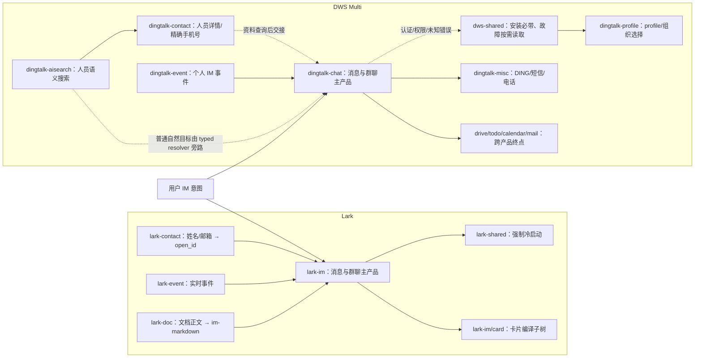

# Lark IM 与 DWS Multi IM Skill 设计对比

> 状态：设计评审
>
> 日期：2026-08-03
>
> DWS Git 基线：分支 `codex/multi-im-optimization`，HEAD
> `017258e5b49517e3787a3d373f90953c128eaf58`
>（`feat(im): optimize Multi IM golden routes`）
>
> 工作区口径：评审时除本文档为未跟踪文件外，DWS 业务代码、Skills、references
> 和 scripts 均与上述 HEAD 一致；因此“当前实现”指该提交，不指远端默认分支。
>
> 对比基线：当前工作区中的 DWS Multi IM 实现，以及本机安装的
> `lark-im`、`lark-shared`、`lark-contact`、`lark-event` Skills
>
> 评审范围：Skill 根入口、shared 契约、目标解析、发送/读取/搜索、群聊、
> 消息资源、卡片、事件、Schema 元数据、task references 与配套脚本

> 实施后说明：本文是对上述提交的历史基线审计，其中“当前问题”、旧脚本路径和
> 文件数统计不代表优化后工作树。实施结果与完成口径见
> [DWS Multi IM 优化方案](dws-multi-im-optimization-plan.md)。被退役脚本的链接作为历史证据保留，
> 不应再被当作可执行入口。

## 1. 执行摘要

当前 DWS Multi IM 的主链设计比 `lark-im` 更适合 Agent 执行：

- 根 Skill 更小，只保留 Golden Route、不可推导的结果语义和按需导航；
- 人名、群名解析已经下沉到共享 typed resolver；
- 发送、读取、搜索、建群和事件 facade 能复用同一套消歧规则；
- 消息查询具有 `complete`、`hasMore`、`failures` 和资源下载 ledger，能够证明
  结果是否完整；
- `event +listen-im` 能把自然目标和事件意图确定性编译为多个 EventKey，并复用
  一个 consume 生命周期；
- 参数、安全、selection 与 interface 事实由 reviewed Schema 输入和 Runtime 交付，
  不需要在根 Skill 复制完整参数表。

但当前实现只完成了“根 Skill 收敛”，还没有完成“整条文档链收敛”。进入第二层
reference 后，部分文档仍会把 Agent 带回手工查 ID、原子发送、原子建群和原子回复；
这些路径不仅增加步骤，还可能从带 `typed_yes` 门禁的 Golden Shortcut 切换到
`confirmation=not_required` 的原子 leaf。Shared 故障文档和三个遗留 Python 脚本也
存在同样的代际漂移。

总体判断：

```text
主链架构：DWS 更优
文档一致性：Lark 更优
任务闭环：DWS 高频路径更优，Lark 富媒体/Thread/Card 更完整
当前主要风险：DWS 子 reference 与脚本仍形成第二套执行语义
```

## 2. 对比方法与口径

本评审以实际文件和当前 CLI 合同为依据，不按命令名称做表面对齐。

事实优先级：

```text
当前 Cobra/Runtime
→ DWS leaf Schema 与 reviewed metadata/selection
→ 产品根 Skill
→ 精确 task reference
→ 全量原子参考与遗留脚本
```

Lark 侧重点读取：

- `~/.agents/skills/lark-im/SKILL.md`
- `~/.agents/skills/lark-shared/SKILL.md`
- `~/.agents/skills/lark-contact/SKILL.md`
- `~/.agents/skills/lark-event/SKILL.md`
- `~/.agents/skills/lark-im/references/`
- `~/.agents/skills/lark-event/references/lark-event-im.md`

DWS 侧重点读取：

- [`dingtalk-chat/SKILL.md`](../skills/multi/dingtalk-chat/SKILL.md)
- [`dws-shared/SKILL.md`](../skills/multi/dws-shared/SKILL.md)
- [`dingtalk-event/SKILL.md`](../skills/multi/dingtalk-event/SKILL.md)
- [`dingtalk-contact/SKILL.md`](../skills/multi/dingtalk-contact/SKILL.md)
- [`dingtalk-aisearch/SKILL.md`](../skills/multi/dingtalk-aisearch/SKILL.md)
- [`dingtalk-chat/references/`](../skills/multi/dingtalk-chat/references/)
- [`event-im.md`](../skills/multi/dingtalk-event/references/event-im.md)
- [`targetresolver`](../internal/shortcut/targetresolver/resolver.go)
- [`event +listen-im`](../internal/app/event_listen_im.go)
- [`chat` Schema registry/metadata/selection](../internal/cli/schema_hints/selection/chat.json)

### 2.1 当前文件体量

| 内容 | Lark | DWS Multi |
|---|---:|---:|
| IM 根 Skill | 249 行 / 21,524 bytes | 103 行 / 8,346 bytes |
| 正常 IM 强制 shared | 211 行 / 10,908 bytes | 0；最小契约内嵌 |
| IM references | 58 个 Markdown，5,336 行 | 9 个 Markdown，1,467 行 |
| IM scripts | 无 | 3 个 Python，565 行 |
| Event 根 Skill | 156 行 / 10,848 bytes | 100 行 / 7,521 bytes |

这组数字不能单独证明设计质量，但能够说明两套系统的基本取向：

```text
Lark：操作手册 + 显式 API/Scope Catalog
DWS：意图编译器 + Runtime/Schema 合同
```

## 3. 根 Skill 逐段映射

### 3.1 Frontmatter 与产品边界

`lark-im/SKILL.md` L1–13：

- 声明 Skill 版本、CLI bin 和 `cliHelp`；
- 将消息、群聊、文件、Reaction、卡片、Feed、Flag 和短信/电话加急都归入 IM；
- 强制先完整读取 `lark-shared`。

[`dingtalk-chat/SKILL.md` L1–14](../skills/multi/dingtalk-chat/SKILL.md#L1)：

- 声明 DWS 最低版本、产品分类和 CLI bin；
- 明确把紧急 DING/短信/电话切到 `dingtalk-misc`，邮件切到 `dingtalk-mail`；
- 不要求正常单产品任务完整读取 `dws-shared`。

判断：DWS 的产品边界更清楚；Lark 的 IM 边界更宽，但因此根文件承担更多平台概念。

### 3.2 对象模型

`lark-im/SKILL.md` L15–34 在根文件定义：

- Message；
- Chat；
- Thread；
- Reaction；
- Flag；
- Feed Shortcut；
- Feed Group；
- Chat → Message/Member → Thread/Reaction/Resource 的对象关系。

DWS 根 Skill 没有完整对象树，只在
[`dingtalk-chat/SKILL.md` L71–78](../skills/multi/dingtalk-chat/SKILL.md#L71)
保留无法从普通 leaf 参数推导的关键区别：

- `openTaskId` 不是消息 ID；
- 子消息使用自己的 `messageId`；
- Favorite、消息 Pin、消息 Top、会话 Top 不是同一对象。

判断：Lark 更适合首次理解平台；DWS 更节省根上下文，但对象语义分散到多个
reference 和 Runtime DTO。

### 3.3 Shared 与身份

`lark-im/SKILL.md` L38–42 和 `lark-shared/SKILL.md` L48–87 显式解释：

- `--as user` 使用 UAT；
- `--as bot` 使用 TAT；
- app scope、用户授权、群成员关系和租户边界共同决定是否成功；
- bot 缺 Scope 与 user 缺 Scope 的恢复路径不同。

DWS 通过
[`runtime-contract.md`](../skills/multi/dws-shared/references/runtime-contract.md)
强调：

- 解析、读取和写入使用同一 profile；
- 不跨组织复用 `userId`、`openDingTalkId`、`openConversationId`；
- 是否确认以最终 Runtime gate 和 Schema 为准。

具体 user/bot/webhook 能力矩阵不在根 Skill 展开，而由 `+messages-send` 的 leaf
Schema 与 Runtime 校验。

判断：DWS 的 typed 交付更可维护，Lark 的身份故障解释更直接。

### 3.4 消息富化与资源

`lark-im/SKILL.md` L44–59 把下列事实直接放在根 Skill：

- sender name 由服务端返回，不额外查询 contact；
- 四个消息读取 Shortcut 默认附加 reactions 和编辑后的 `update_time`；
- 三个读取 Shortcut 支持 `--download-resources`；
- 资源按 `(message_id, file_key)` 去重、并发下载、单项失败隔离。

DWS 在
[`dingtalk-chat/SKILL.md` L71–77](../skills/multi/dingtalk-chat/SKILL.md#L71)
只保留任务级结果语义：

- list/search/mget 共享稳定消息投影；
- 检查 `complete`、`hasMore`、`failures`；
- 下载失败进入 ledger，不丢弃已取得消息；
- 路径必须位于工作目录内，默认不覆盖，完成后原子落盘。

内部由 [`chatmsg`](../internal/shortcut/chatmsg/chatmsg.go) 维护
`im.message-list.v1`、reaction、`updateTime`、`resourceRefs` 和分页完整性。

判断：DWS 更强调“能否证明完整”；Lark 更强调字段来源、批量并发和缺字段语义。

### 3.5 卡片、音频与跨产品内容

`lark-im/SKILL.md` L61–75 在根文件声明：

- Interactive Card 发送前必须读取专用建卡 workflow；
- 卡片 callback 走 `card.action.trigger`；
- Opus 才能作为语音消息；
- Lark Doc 内容应以 `im-markdown` 读取后再用 Markdown 发送。

DWS 根 Skill只将流式卡片路由到 `+messages-send-card`，并把参数交给精确 leaf
Schema。当前 DWS 卡片是创建/流式更新模型，不等同于 Lark 任意 Interactive Card
JSON，也没有同等的 callback Skill 闭环。

判断：DWS 的根设计更紧凑；Lark 的卡片设计和回调闭环更完整。该差异属于真实平台
能力差异，不应通过复制参数伪装对齐。

### 3.6 Shortcut 发现

`lark-im/SKILL.md` L100–126 在根文件逐项列出 22 个高阶 Shortcut。

[`dingtalk-chat/SKILL.md` L28–60](../skills/multi/dingtalk-chat/SKILL.md#L28)
只说明当前有 97 个公开 Shortcut，并暴露：

- 8 条 Golden Route；
- 6 条次级直接入口；
- 完整 Catalog 仅作最后发现回退。

判断：

- 高频首次选路：DWS 更好；
- 低频能力人工浏览：Lark 更直接；
- DWS 必须保证精确 references 与 Golden Route 一致，否则隐藏全量 Catalog 后将缺少
  可靠的第二层导航。

### 3.7 原生 API 与 Scope

`lark-im/SKILL.md` L128–249 继续列出原生 API 资源和完整 Scope 表；调用原生 API 前
要求先查询 Schema。

DWS 根 Skill不放原子 API 和 Scope 表，只在最后降级到
[`chat.md`](../skills/multi/dingtalk-chat/references/chat.md)，并把参数、selection、安全和
interface 事实交给 reviewed Schema 输入。

判断：DWS 更符合单一事实源和防漂移目标；Lark 更方便人工排障，但静态权限表与参数表
的维护成本更高。

## 4. 相关 Skill 与子产品设计

### 4.1 Shared 冷启动

Lark 的每个 IM task reference 都重复声明必须先读 `lark-shared`。优点是身份、授权、
JSON envelope 和高风险 exit-10 协议随处可见；代价是高频任务反复加载同一大段文本。

DWS 把 11 行最小契约作为 authored source，通过
[`gen_skill_shortcut_sections.py` L193–210](../scripts/gen_skill_shortcut_sections.py#L193)
注入 Chat 与 Shared。正常 IM 只读产品根 Skill，认证、权限、profile 和未知错误才进入
Shared reference。

这是 DWS 相对 Lark 最明确的架构改进之一。

当前边界问题：生成器只注入 Chat 和 Shared，但
[`dws-shared/SKILL.md` L14](../skills/multi/dws-shared/SKILL.md#L14)
泛称“产品根 Skill 已内嵌最小执行契约”。Contact、AI Search 仍强制完整读取 Shared，
Event 则没有注入该 marker。这一描述应收窄为真实覆盖范围，或将注入机制推广到其它
明确需要独立冷启动的产品根。

### 4.2 Contact、AI Search 与目标解析

Lark 的姓名发送仍是两条业务命令：

```text
lark-contact +search-user
→ Agent 选择 open_id
→ lark-im +messages-send
```

群名读取同样先 `+chat-search` 再调用消息读取。

DWS 将确定性目标解析下沉到
[`targetresolver`](../internal/shortcut/targetresolver/resolver.go)：

- `ResolveUser`；
- `ResolveChat`；
- `ResolveUsers`；
- `ResolveChats`；
- 稳定 ID 去重；
- exact/unique 匹配；
- `ambiguous` / `not_found` 结构化 candidates；
- 批量全量预检。

它被 `+dm`、`+send-to-group`、`+messages-send`、`+chat-messages`、`+search-msg`、
`+chat-create` 和 `event +listen-im` 复用。

判断：DWS 在高频 IM 目标解析上明显优于 Lark。Contact/AI Search 仍应保留给人员详情、
组织关系和独立搜索意图，但不应重新成为普通发消息的强制前置步骤。

### 4.3 Event

Lark Event 是跨产品通用控制面：

- 根 Skill 负责 list/schema/consume、ready、stdin、退出码和 jq；
- IM reference 维护 12 个 EventKey；
- 一个 consume 进程只接受一个 EventKey；
- 多事件由多个进程完成。

DWS Event 是个人 IM 专用产品，并增加
[`event +listen-im`](../internal/app/event_listen_im.go)：

```text
kind + events + target
→ typed resolver
→ 确定 EventKey 集合
→ 一次 event consume 生命周期
```

DWS 能在一个进程中复用单 bus、多 consumer、ready marker、NDJSON、回滚和退出清理。

判断：

- 高频个人 IM 监听：DWS 更适合 Agent；
- 跨产品事件和任意 payload/jq 探索：Lark 更通用；
- DWS 不应复制 Lark 的“一 EventKey 一进程”限制。

### 4.4 子文件粒度

Lark 采用“一个高阶 Shortcut 一个 reference”的细粒度模式，并为卡片拆出 schema、
style、组件和 callback workflow。优点是加载后任务边界清晰，缺点是文件总数和总体积较大。

DWS 采用较少、较宽的子产品 reference：

- [`01-messaging.md`](../skills/multi/dingtalk-chat/references/01-messaging.md)：任务级组合；
- [`chat-message.md`](../skills/multi/dingtalk-chat/references/chat/chat-message.md)：消息、搜索、卡片、Reaction、Pin/Top/Favorite；
- [`chat-group.md`](../skills/multi/dingtalk-chat/references/chat/chat-group.md)：群与成员；
- [`chat-bot.md`](../skills/multi/dingtalk-chat/references/chat/chat-bot.md)：Bot 与 Webhook；
- [`chat-conversation.md`](../skills/multi/dingtalk-chat/references/chat/chat-conversation.md)：会话状态；
- [`chat.md`](../skills/multi/dingtalk-chat/references/chat.md)：全量原子降级。

这种粒度本身合理，但每个宽 reference 必须先重申自己负责的 Golden Shortcut，再把原子
命令放入明确的降级区。当前部分文件仍以原子命令作为正文主路径，导致加载 reference 后
发生路由反转。

### 4.5 子产品依赖闭包

这里的“相关子产品”按真实导航边定义：根 Skill、reference 或 Runtime 会把任务交给它，
而不是仅仅因为它也属于协作套件。



#### Lark 子产品逐项

| 子产品/子树 | 进入条件 | 合同所有者 | 与 IM 的关系 |
|---|---|---|---|
| `lark-im` | 消息、群、资源、reaction、flag、feed、urgent、card | IM 根 Skill + 精确 Shortcut reference + CLI | 主产品 |
| `lark-shared` | 所有 IM/Event 操作前 | 认证、user/bot、scope、JSON envelope、exit 10 | 强制前置；每个 IM task reference 再次提醒 |
| `lark-contact` | 姓名/邮箱目标、已知 ID 补资料 | `+search-user` / `+get-user` | 普通按姓名发消息仍需 `contact → im` 两步 |
| `lark-event` | 实时消息、reaction、群变化、card callback | 通用 `event consume` 生命周期 | IM 只是 12 个 EventKey 中的一个 topic；一 key 一进程 |
| `lark-doc` | 把文档正文作为消息发送 | `--doc-format im-markdown` | 内容生产者；IM 保持原文并以 Markdown 发送 |
| `lark-im/references/card` | 发送 `interactive` 卡片 | card schema、style、component、resource | 不是独立产品，但拥有独立编译/校验工作流 |
| `lark-openapi-explorer` | Contact 不覆盖的部门树/组织架构 | 原生 OpenAPI 探索 | 仅由 Contact 边界引出，不属于普通 IM 链 |

Lark 没有独立 profile 子产品。身份切换集中在 `lark-shared` 的 `--as user|bot`；紧急
应用内/短信/电话能力留在 `lark-im`，没有像 DWS 一样拆到 sibling Skill。

#### DWS Multi 子产品逐项

| 子产品 | 进入条件 | 合同所有者 | IM 链中的地位 |
|---|---|---|---|
| [`dingtalk-chat`](../skills/multi/dingtalk-chat/SKILL.md) | 消息、群聊、资源、Bot/Webhook、会话状态 | Golden Route + Runtime Shortcut + leaf Schema | 主产品 |
| [`dws-shared`](../skills/multi/dws-shared/SKILL.md) | 安装时始终附带；认证/权限/profile/confirmation/未知错误时读取 | 最小 Runtime 契约与故障导航 | 正常路径不冷启动，故障路径按需 |
| [`dingtalk-profile`](../skills/multi/dingtalk-profile/SKILL.md) | 多账号、多组织、切换 profile | profile/组织选择规则 | 由 shared 引出；保障解析、读取、写入同 profile |
| [`dingtalk-aisearch`](../skills/multi/dingtalk-aisearch/SKILL.md) | 姓名、工号、职责、上下级、部门语义搜索 | 人员语义候选 | 普通 DM/群目标已由 Chat typed resolver 内化，不再是强制前置 |
| [`dingtalk-contact`](../skills/multi/dingtalk-contact/SKILL.md) | 已知 ID 补详情、完整手机号、部门/角色 | 精确通讯录事实 | 作为资料查询/低层 ID 补全 sibling |
| [`dingtalk-event`](../skills/multi/dingtalk-event/SKILL.md) | 监听消息、reaction、已读、撤回、群生命周期 | `+listen-im` 与 `event consume` | 个人 IM 实时入口；回复交回 Chat |
| [`dingtalk-misc`](../skills/multi/dingtalk-misc/SKILL.md) | DING、短信、电话、班级群 | Misc 内部的 Ding 等 reference | Chat 明确排除，产品边界比 Lark 更窄 |
| [`dingtalk-mail`](../skills/multi/dingtalk-mail/SKILL.md) | 用户目标是邮件 | Mail Skill | Chat 边界排除 |
| [`dingtalk-drive`](../skills/multi/dingtalk-drive/SKILL.md) | 查询群钉盘/群文件 | Drive Skill | 先由 Chat 取 `spaceId`，再交给 Drive |
| [`dingtalk-todo`](../skills/multi/dingtalk-todo/SKILL.md) | 消息转待办 | Todo Skill | Chat 读取真实消息上下文后交接 |
| [`dingtalk-calendar`](../skills/multi/dingtalk-calendar/SKILL.md) | 消息转日程 | Calendar Skill | Chat 读取时间、地点、参会人后交接 |

不应把 `dingtalk-dev` 计入日常 IM 数据链。它管理应用、机器人配置或开发控制面；当前
Chat 根 Skill 和精确 task references 没有把普通消息任务路由到它。

### 4.6 Multi 安装与发布边界

DWS Multi 不只是仓库里的文档目录，它有独立交付边界：

1. [`skills/embed.go` L23–29](../skills/embed.go#L23) 将 `mono` 与 `multi` 整棵目录嵌入
   二进制，包含 references 和 scripts；
2. [`skill_setup.go` L77–95](../internal/app/skill_setup.go#L77) 将 multi 标记为
   `EXPERIMENTAL/Preview`，支持按子 Skill 安装；
3. [`skill_setup.go` L139–156](../internal/app/skill_setup.go#L139) 即使用户只选 Chat，也会
   强制附带 `dws-shared`；
4. 安装采用 additive 语义，不删除未列出的已安装 sibling Skill；
5. Release 的 `dws-skills.zip` 同时携带根部兼容 mono、显式 `mono/` 和完整 `multi/`。

这带来一个重要设计结论：Multi reference/script 是真实发布产物，不能按“开发辅助文件”
处理。但当前 Agent Schema 生成的 Markdown evidence 入口仍主要是 `skills/mono/`；Multi
文档并不会因为 Schema 生成成功就自动证明自己与 Runtime 一致。这正是第二层漂移需要
独立 policy gate 的原因。

## 5. References 逐文件对比

### 5.1 Lark IM references 全量清单

Lark IM 共 58 个 Markdown reference：顶层 26 个，Card 子树 32 个。根 Skill 直接链接
全部 21 个 Shortcut task reference，并另外链接 enrichment、reaction、feed 原子合同和
card workflow。它的基本单元是“一个任务/一个 Shortcut/一个精确合同”。

| 顶层 reference | 行数 | 职责 | DWS 对应/差异 |
|---|---:|---|---|
| `lark-im-card-action-reply.md` | 175 | `card.action.trigger` 监听、解析、回卡 | DWS 无等价 callback Skill 闭环 |
| `lark-im-chat-create.md` | 162 | 建群、身份、owner、成员、输出 | `+chat-create` + `chat-group.md`；DWS 自然成员解析更强 |
| `lark-im-chat-identity.md` | 55 | 群主、user/bot 操作者判断 | DWS 分散在 profile、Schema identity 和 Runtime |
| `lark-im-chat-list.md` | 166 | 当前身份加入的会话、排序、分页、mute | DWS 会话/群列表 Shortcut 与 `chat-conversation.md` |
| `lark-im-chat-members-list.md` | 83 | users/bots 分桶与截断语义 | DWS `group members`；无同等独立 truncation reference |
| `lark-im-chat-messages-list.md` | 157 | 单会话消息、thread 展开、资源、分页 | DWS `+chat-messages`；更强调 complete/failures ledger |
| `lark-im-chat-search.md` | 142 | 按关键词/成员搜群、mute、分页 | DWS `+chat-search` 或目标 resolver |
| `lark-im-chat-update.md` | 84 | 群名/描述更新与身份边界 | DWS group rename/settings；没有统一精确 task reference |
| `lark-im-feed-group-list-item.md` | 68 | 列出标签内 feed cards | DWS category list-conversations，平台语义不完全相同 |
| `lark-im-feed-group-list.md` | 65 | 列出 feed groups | DWS category list |
| `lark-im-feed-group-query-item.md` | 44 | 按 ID 查标签成员 | DWS category batch/list-by-conv，仅近似映射 |
| `lark-im-feed-groups.md` | 452 | Feed Group 原子 API、枚举、规则、scope | DWS `chat-conversation.md` 的 category 族；不应字段级复制 |
| `lark-im-feed-shortcut-create.md` | 97 | 会话 Feed 置顶、批量结果 ledger | DWS conversation set-top，缺少同粒度 task reference |
| `lark-im-feed-shortcut-list.md` | 103 | Feed 置顶列表与 detail enrichment | DWS `+conversation-list-top` |
| `lark-im-feed-shortcut-remove.md` | 48 | 取消 Feed 置顶与幂等语义 | DWS set-top off |
| `lark-im-flag-cancel.md` | 67 | message/feed 两层 flag 的 best-effort cancel | DWS Favorite/Top 对象不同，不应机械对应 |
| `lark-im-flag-create.md` | 67 | 创建 message/feed flag 与合法组合 | DWS Favorite/消息 Top 仅部分近似 |
| `lark-im-flag-list.md` | 101 | flag 排序、分页上限、thread enrichment | DWS list-favorites 等分散能力 |
| `lark-im-message-enrichment.md` | 54 | reaction、更新时间、thread、资源富化合同 | DWS 根结果语义 + `chatmsg` Runtime；不是独立 reference |
| `lark-im-messages-mget.md` | 99 | 最多 50 条批量消息详情 | DWS `+messages-mget` |
| `lark-im-messages-reply.md` | 277 | 安全、内容格式、媒体、thread reply、返回值 | DWS `+messages-reply` 当前只覆盖较窄文本引用回复 |
| `lark-im-messages-resources-download.md` | 94 | 资源 key、8 MB 分块、扩展名检测 | DWS `+messages-resource-download`；本地安全/ledger 更强 |
| `lark-im-messages-search.md` | 234 | 搜索、自动二步富化、分页、报告生成 | DWS `+search-msg`；typed target 与完整性更强 |
| `lark-im-messages-send.md` | 279 | user/bot 发送、内容格式、媒体、mention、返回值 | DWS `+messages-send`；平台能力矩阵不同 |
| `lark-im-reactions.md` | 299 | reaction CRUD/batch、完整 emoji enum | DWS reaction/文字表情分散在 `chat-message` + emoji 表 |
| `lark-im-threads-messages-list.md` | 115 | thread ID 来源、分页、资源 | DWS `+thread-replies`，当前主要是 reader |

Card 的 32 个子文件不是普通“补充说明”，而是一个内嵌小型子产品：

| 层 | 文件数 | 文件 | 设计职责 |
|---|---:|---|---|
| 工作流 | 1 | `lark-im-card-create.md` | 强制生成/校验/发送流程；禁止手写卡片 payload |
| Schema | 1 | `card-2.0-schema.md` | 卡片 2.0 可用组件及嵌套关系 |
| Style | 1 | `lark-im-card-style.md` | 版式、层级、间距、视觉规范 |
| Components | 27 | `button`、`chart`、`checker`、`collapsible_panel`、`column_set`、`date_picker`、`div`、`form`、`header`、`hr`、`img`、`img_combination`、`input`、`interactive_container`、`markdown`、`multi_select_person`、`multi_select_static`、`overflow`、`person`、`person_list`、`picker_datetime`、`picker_time`、`recycling_container`、`select_img`、`select_person`、`select_static`、`table` | 每组件合法字段、枚举、嵌套和示例 |
| Resources | 2 | `colors.md`、`icons.md` | 受控视觉枚举 |

DWS 当前只有流式卡片发送/更新命令和 `chat-message.md` 中约 10 行说明，没有对应的卡片
Schema/组件/风格/callback 子树。因此卡片差异不是“少写几篇 reference”，而是缺少一个
可独立审计的卡片编译层。

### 5.2 DWS Chat references 全量清单

| reference | 行数 | 当前角色 | 主要问题 | 建议归宿 |
|---|---:|---|---|---|
| [`01-messaging.md`](../skills/multi/dingtalk-chat/references/01-messaging.md) | 76 | Golden Route 不能单步覆盖时的任务编排 | 与根路由总体一致 | 保留为任务级主 reference |
| [`chat-emoji-list.md`](../skills/multi/dingtalk-chat/references/chat-emoji-list.md) | 209 | 199 个默认表情枚举 | 静态大表；易随平台漂移 | 若 Runtime 可查询则生成，否则加来源/更新时间门禁 |
| [`intent-guide.md`](../skills/multi/dingtalk-chat/references/intent-guide.md) | 51 | 低频意图与对象层级消歧 | 与根路由一致 | 保留，继续限制为低频加载 |
| [`lite-recipes.md`](../skills/multi/dingtalk-chat/references/lite-recipes.md) | 5 | recipe 导航壳 | 只重定向到 `01-messaging`，价值很低 | 合并或删除，减少无效跳转 |
| [`chat.md`](../skills/multi/dingtalk-chat/references/chat.md) | 363 | 原子能力总索引与回退 | 前 20 行说 Shortcut 优先，后续大量意图表又把原子命令设为默认 | 降级为纯 Catalog/原子 fallback，不再承担任务选路 |
| [`chat-message.md`](../skills/multi/dingtalk-chat/references/chat/chat-message.md) | 269 | 消息、搜索、卡片、reaction、资源 | L23 起重新以原子 send 为主；reply 也回退原子路径 | 先列对应 Shortcut，再隔离原子特殊字段区 |
| [`chat-group.md`](../skills/multi/dingtalk-chat/references/chat/chat-group.md) | 215 | 群、成员、公告、设置、身份 | L32 起以原子建群为主，L186 再次手工搜人 | `+chat-create` 为默认；管理原子命令保留 |
| [`chat-bot.md`](../skills/multi/dingtalk-chat/references/chat/chat-bot.md) | 139 | Bot/Webhook、机器人进群/撤回 | L11 与根 `+messages-send --as bot/webhook` 直接冲突 | 统一发送走 Shortcut；专属管理能力保留 |
| [`chat-conversation.md`](../skills/multi/dingtalk-chat/references/chat/chat-conversation.md) | 140 | 会话状态、Top、mute、category | 仍手工 `aisearch → conversation-info`，部分能力缺 Shortcut 首选说明 | 按对象层级列高阶入口；原子管理作为细节 |

DWS 的优点是只有 9 个 Chat reference，Agent 不必在 58 个文件中发现入口；缺点是每个
文件跨度过宽，任务级路由、原子 Catalog、参数表、工作流和错误处理常在同一文件内混合。
Lark 的精细拆分值得吸收，但不必照搬“一 Shortcut 一文件”到所有 97 个 Shortcut。

### 5.3 相关子产品 references

| 子产品 | reference/script 规模 | IM 实际读取点 | 评审结论 |
|---|---|---|---|
| `dws-shared` | 12 个 reference：`runtime-contract`、`routing`、`workflow-routing`、`global-reference`、`error-codes`、`capability-limits`、`channel-login`、`url-patterns`、`intent-guide` 和 3 个 common recipe/convention 文件 | 正常 Chat 不预读；错误、跨产品或 URL 不明时精确进入 | 分层正确，但 `global-reference`/`error-codes` 已有 Runtime 漂移 |
| `dingtalk-event` | 1 个 `event-im.md`，399 行 | 群生命周期、精确 EventKey、Filter、订阅运维/排障 | 单文件过宽；高频已回根，建议再拆 lifecycle/filter/ops |
| `dingtalk-contact` | 5 个 reference + 1 个 `contact_dept_members.py` | 人员资料、完整手机号、部门/角色；不是普通 DM 必经 | 根 Skill 仍重、仍优先脚本；与 Chat 新 resolver 代际不同 |
| `dingtalk-aisearch` | 3 个 reference，无脚本 | 语义找人、跨源检索 | 对独立搜索正确；不应回流为 Chat 普通自然目标前置 |
| `dingtalk-profile` | 规则集中在根 Skill | 多组织/profile 消歧 | 应由 shared/Runtime 统一，不应复制到每个 Chat reference |

Lark 相关 sibling 的规模更小：`lark-contact` 只有 2 个 task reference，`lark-event` 的 IM
部分只有 1 个 86 行 reference；但它把较多通用生命周期合同放在各自根 Skill。DWS 则把
Event 的大量运维细节放入一个 399 行 IM 文件，两侧“文件数”不能脱离根文件体量比较。

### 5.4 Reference 加载链结论

理想链路应满足：

```text
根 Skill 选意图
→ 一个精确 task reference 补充不可推导语义
→ leaf Schema 提供参数/安全/interface 真相
→ Runtime 执行
```

当前 Lark 基本符合这个形状，但根和 shared 更重；当前 DWS 根已经符合，第二层却常变成：

```text
根 Skill 选 Golden Shortcut
→ 宽 reference 重新选原子命令
→ 复制静态 flags/返回结构
→ 绕开原 Shortcut 的 resolver、DTO 或 confirmation gate
```

所以 DWS 的整改重点不是增加 reference 数量，而是让每个 reference 只拥有一种职责：
任务选路、平台语义、原子 fallback 或静态枚举，不能四者混合。

## 6. Scripts 逐文件对比

### 6.1 Lark IM scripts

`lark-im`、`lark-contact`、`lark-event` 当前均没有产品内 `scripts/`。这不是能力缺失：

- 自动分页、thread 展开、reaction 富化、资源下载、目标搜索等编排在 CLI Shortcut 内；
- 卡片生成通过 reference 驱动的 workflow 完成；
- Event 的长连接生命周期由 `event consume` 承担；
- 因而不存在“脚本自行解析 CLI JSON、再调用第二套原子命令”的旁路。

### 6.2 DWS Chat 产品 scripts

Multi Chat 的 3 个 Python 会随 `skills/multi` 一起嵌入二进制和发布包，即使根 Skill 与
references 没有导航到它们。它们不是未交付的草稿，而是“已交付但不可发现”的旁路。

| script | 行数 | 做什么 | 逐行级问题 | 建议 |
|---|---:|---|---|---|
| [`bot_broadcast.py`](../skills/multi/dingtalk-chat/scripts/bot_broadcast.py) | 112 | 对多个会话逐个调用机器人发送 | L92–99 直接调用原子 `send-by-bot`；仅以进程码/是否有 JSON 判断成功；无 profile、confirmation、幂等键、逐项 unknown ledger | 若真实需要批量能力，应下沉为 typed Runtime Shortcut；否则删除 |
| [`chat_export_messages.py`](../skills/multi/dingtalk-chat/scripts/chat_export_messages.py) | 230 | 搜群、翻页、导出 JSON | L88 默认 `groups[0]`；自行兼容多种旧 envelope；固定 `+08:00`；直接写任意输出路径；没有 `complete/failures/resource` 合同 | 已被 `+chat-messages --chat-query` 和任务结果合同覆盖，应删除或只做稳定 DTO 导出器 |
| [`chat_history_with_user.py`](../skills/multi/dingtalk-chat/scripts/chat_history_with_user.py) | 223 | 搜人、翻页、导出单聊 | L57 明示返回首项，L80 `users[0]`；还调用已不推荐的 `contact user search`；同样自行猜 envelope、固定时区和直接写文件 | 已被 `+chat-messages --user-query` 覆盖，应删除 |

还有一层副本漂移：同名脚本同时存在于 `skills/mono/scripts/` 和
`skills/multi/dingtalk-chat/scripts/`。`bot_broadcast.py` 当前字节一致；另外两个已经不同，
Multi 副本新增 `nextCursor` 与错误兼容，而 Mono 副本未同步。没有单一 authored source 或
生成门禁时，即使保留脚本，也会形成 mono/multi 两套行为。

### 6.3 DWS 仓库级相关 scripts

这些 scripts 不随单个 Chat Skill 作为操作 recipe 使用，但决定 Shortcut、Skill 文档、
测试证据和发布质量。应与产品脚本分开评审。

| script | 行数 | 角色 | 是否覆盖 Multi 第二层 |
|---|---:|---|---|
| [`gen_skill_shortcut_sections.py`](../scripts/gen_skill_shortcut_sections.py) | 253 | 从公开 Catalog 生成 Shortcut 区块，并把最小 Runtime contract 注入 Chat/Shared | 只改根 Skill 生成块，不改 Chat references/scripts |
| [`check-skill-context-budget.sh`](../scripts/policy/check-skill-context-budget.sh) | 109 | Chat/Event 根字节预算、必备 Golden Route、旧路由禁词 | 不扫描 references/scripts |
| [`check-skill-commands.sh`](../scripts/policy/check-skill-commands.sh) | 16 | 构建并运行 Skill 命令静态检查器 | 检查命令可解析，不证明首选路由/安全门禁一致 |
| `gen_shortcut_public_catalog.py` | 255 | 生成公开 Shortcut Catalog 和 Go 投影 | Runtime Catalog 层，不审文档加载链 |
| `gen_shortcut_test_matrix.go` | 316 | 通过真实 Cobra 树与 fake caller 装配全部 Shortcut | 证明命令装配，不审原子 reference 旁路 |
| `gen_shortcut_comparison.py` | 580 | 聚合 Shortcut 对比和测试 HTML | 报告生成，不是 policy gate |
| `gen_shortcut_backend_mcp_issues.py` | 237 | 汇总下层 MCP 对接问题 | Runtime 后端审计 |
| `gen_shortcut_error_review.py` | 449 | 将测试失败映射到修复位置 | 测试报告辅助 |
| `record_real_shortcut_run.py` | 135 | 记录真实 Shortcut 运行结果 | 单次证据采集 |
| `shortcut_real_result.py` | 480 | 统一解析真实运行的成功/失败事实 | 审计公共库，不供产品脚本复用 |
| `run_shortcut_real_write_matrix.py` | 455 | 真实写 Shortcut 矩阵 | 跨产品写审计 |
| `run_chat_shortcut_live_audit.py` | 1,162 | Chat 只读 Shortcut 真实链路审计 | Runtime 很深，但不扫描文档 |
| `run_chat_shortcut_live_write_audit.py` | 865 | Chat 真实写入/清理审计 | Runtime 很深，但不扫描产品 scripts |
| `run_chat_shortcut_write_dry_run_audit.py` | 1,101 | Chat 写 Shortcut dry-run 合同审计 | 证明 Shortcut 预览，不证明 reference 会选择它 |

因此当前 DWS 已有大量 Runtime/Shortcut 审计资产，真正缺的是很薄的一层“发布内容一致性”
检查，而不是再增加一个大型 live audit：

1. 枚举 Multi 根 Skill 的所有 reference 边；
2. 抽取 reference 和产品 script 中出现的 CLI path；
3. 与 reviewed selection、Runtime confirmation 和 Golden Route 对照；
4. 拒绝 `users[0]`/`groups[0]`、旧 envelope、未声明原子 fallback；
5. 检查 mono/multi 同名脚本是否来自单一源或明确允许差异。

## 7. 能力对比

| 场景 | 更强的一方 | 说明 |
|---|---|---|
| 按姓名/群名直接发送 | DWS | 一条业务命令完成解析、消歧和发送 |
| 自然目标读取、搜索和建群 | DWS | 共享 resolver、批量预检、结构化歧义 |
| 分页完整性与 partial result | DWS | `complete/hasMore/failures` 任务级合同 |
| 统一发送身份 | DWS | 一个 `+messages-send` 承载 user/bot/webhook 的真实子集 |
| Thread 自动展开 | Lark | list/mget 默认扩展 replies；DWS 使用单独读取入口 |
| 回复能力 | Lark | 支持 user/bot、媒体和 thread reply；DWS 当前只做用户纯文本引用回复 |
| 卡片创建与 callback | Lark | 建卡 workflow、Schema、自检和 `card.action.trigger` 完整 |
| 资源下载细节 | Lark | 8 MB 分块、扩展名检测和身份 Scope 描述更完整 |
| 下载安全与完整性 ledger | DWS | 相对路径、默认不覆盖、原子落盘、失败并入任务完整性 |
| 多事件 Agent 监听 | DWS | 多 EventKey、自然目标、单进程统一生命周期 |
| 通用跨产品事件 | Lark | 同一 Event Skill 覆盖 IM/Approval/Task/VC 等 |
| Scope/身份人工排障 | Lark | 根 Skill 与 shared 更显式 |
| 参数和安全防漂移 | DWS | reviewed registry + metadata + selection + generated Catalog |
| Feed/会话分类 | 不可直接比较 | 平台对象不同，不能只按名称映射 |
| 紧急短信/电话 | 产品边界不同 | Lark 放在 IM；DWS 放在 `dingtalk-misc` |

## 8. 当前设计漂移

### 8.1 高优先级：子 reference 把 Golden Shortcut 降级为原子写路径

根 Skill 已冻结以下入口：

```text
建群          → +chat-create
引用回复      → +messages-reply
高级/Bot/Webhook 发送 → +messages-send
```

但子 reference 仍保留相反的默认路线：

1. [`chat-group.md` L32–49](../skills/multi/dingtalk-chat/references/chat/chat-group.md#L32)
   以 `chat group create` 为建群主入口；L186–192 又要求先手工执行 `aisearch person`。
2. [`chat-message.md` L23–68](../skills/multi/dingtalk-chat/references/chat/chat-message.md#L23)
   以原子 `chat message send` 为发送主入口；L146–153 以原子 `message reply` 为引用回复。
3. [`chat-bot.md` L11–15](../skills/multi/dingtalk-chat/references/chat/chat-bot.md#L11)
   强制所有 Bot 发送使用原子 `send-by-bot`；L75–86 继续推荐原子 Webhook。
4. [`event-im.md` L308–312](../skills/multi/dingtalk-event/references/event-im.md#L308)
   自动回复仍调用原子 `chat message send`，与 Event 根 Skill 的 `+messages-send` 不一致。

这不是单纯的命令风格差异。当前 reviewed metadata 中：

- `+chat-create`、`+messages-reply`、`+messages-send` 为
  `confirmation=user_required`、`runtime_gate=typed_yes`；
- 原子 `chat message send` 和 `chat message reply` 为
  `confirmation=not_required`；
- 当前 leaf Schema 同样显示原子 group create、bot send、webhook send 为
  `not_required`。

因此，加载低频 reference 可能让同一个用户意图切换到更弱的安全门禁，同时失去 typed
resolver、dry-run parity、稳定输出 DTO 或 continuation context。

### 8.2 高优先级：策略门禁只检查根 Skill

[`check-skill-context-budget.sh`](../scripts/policy/check-skill-context-budget.sh)
当前检查：

- 根 Skill 字节预算；
- Golden Route 必备字符串；
- 根 Skill 中的旧 `aisearch`、Webhook、媒体上传和 shared 冷启动模式；
- 根 Skill 是否重新展开完整 Shortcut 表。

它不扫描：

- `dingtalk-chat/references/**`；
- `dingtalk-event/references/**`；
- `dingtalk-chat/scripts/**`；
- reference 中的高阶入口与原子入口 confirmation 差异。

所以当前门禁可以通过，但无法证明整条 Skill 加载链一致。

### 8.3 高优先级：遗留 Python 脚本违反 typed resolver 原则

当前 Chat Skill 目录仍包含：

- [`chat_history_with_user.py`](../skills/multi/dingtalk-chat/scripts/chat_history_with_user.py)；
- [`chat_export_messages.py`](../skills/multi/dingtalk-chat/scripts/chat_export_messages.py)；
- [`bot_broadcast.py`](../skills/multi/dingtalk-chat/scripts/bot_broadcast.py)。

其中：

- `chat_history_with_user.py` 搜人后直接选择 `users[0]`；
- `chat_export_messages.py` 搜群后直接选择 `groups[0]`；
- `bot_broadcast.py` 逐群调用原子 `send-by-bot`，不复用统一发送合同；
- 三者均未被当前 Multi Chat 根 Skill 或 references 导航引用。

这些脚本形成孤立的第二套解析、分页、发送和错误处理系统，且直接违反“多候选禁止选择
第一项”的最小运行契约。

### 8.4 中优先级：Shared 故障文档已落后于 Runtime

[`global-reference.md`](../skills/multi/dws-shared/references/global-reference.md) 仍声明：

- `--format` 默认 table；
- JSON 成功统一为 `{"success":true,"body":...}`；
- 存在旧的全局 token 参数描述。

当前 CLI leaf Help 默认 JSON，Shortcut 又会输出各自的版本化 DTO。

[`error-codes.md` L65–70](../skills/multi/dws-shared/references/error-codes.md#L65)
仍声称 Chat text 是位置参数而不是 flag；当前 Runtime Help 明确推荐 `--text`。

正常 IM 不加载这些文件是正确的，但一旦发生认证或执行错误，Agent 恰好会被路由到这些
过期信息，因此故障路径的一致性仍然重要。

### 8.5 中优先级：Shared 注入范围与文案不一致

`dws-shared` 声称产品根 Skill 已从同一来源内嵌最小契约，但生成器当前只更新 Chat 与
Shared。Contact、AI Search 继续强制读取 Shared；Event 没有受控注入 marker。

两种方案都可以成立，但必须选择一种明确合同：

1. 文案收窄为“Chat 等已迁移产品根已内嵌”；或
2. 将 marker 与生成门禁推广到全部需要独立冷启动的产品根。

### 8.6 低优先级：Event 根仍保留较多运维细节

当前 Event 根 Skill 已由 254 行缩至 100 行，但仍包含：

- 16 个兼容 EventKey；
- ready marker 细节；
- `0/2/1` 重试预算；
- 本地订阅保护文件路径和权限。

这些内容本身正确，但与“根只保留高频入口，完整 EventKey/ready/retry 运维进入按需
reference”的目标仍有距离。可以根据真实误用率决定是否继续迁移，不应仅为缩短而删除
关键长连接安全信息。

## 9. 建议目标结构

### 9.1 保留 DWS 当前根设计

不要把 Lark 的完整 API、Scope 和 Shortcut 表复制回 DWS 根 Skill。目标结构继续保持：

```text
Frontmatter / 产品边界
→ 最小 Runtime 契约
→ Golden Route
→ 不可推导的结果语义
→ 精确 task reference 导航
→ 最短错误分流
```

### 9.2 吸收 Lark 的精确 reference 原则

每个 reference 开头都应先声明本文件负责的高阶入口：

```text
默认入口
→ 关键结果与安全语义
→ 平台限制
→ 只有需要原始响应/特殊下层能力时才进入原子降级
```

原子命令不应与 Golden Shortcut 并列为两个默认答案。

### 9.3 收敛子文件

建议按以下规则重写：

| 文件 | 默认高阶入口 | 原子命令保留条件 |
|---|---|---|
| `chat-message.md` | `+messages-reply`、`+messages-forward*`、`+messages-send-card`、`+flag-*` | 高阶入口未暴露的特殊字段或原始响应 |
| `chat-group.md` | `+chat-create`、群成员/设置对应 Shortcut | 无自然目标支持或 Shortcut 不覆盖的管理能力 |
| `chat-bot.md` | `+messages-send --as bot/webhook` | 多群广播、机器人撤回、入群等专属能力 |
| `chat-conversation.md` | `+conversation-list-top` 与对应 Shortcut | 低频分类/状态原子能力 |
| `event-im.md` | `+listen-im`、回复使用 `chat +messages-send` | 群生命周期、显式 EventKey、Filter DSL、订阅运维 |

### 9.4 处理遗留脚本

三种可选策略按推荐顺序排列：

1. 已由 Golden Shortcut 完全覆盖的脚本从 Multi 发布包删除；
2. 仍有价值的脚本改为调用 Golden Shortcut，并解析其稳定 DTO；
3. 只有 Runtime 暂时无法承载的批量流程才保留脚本，同时增加 typed candidates、
   profile、confirmation、partial failure ledger 和测试。

禁止继续维护“脚本自己搜第一个候选、自己拼原子写命令”的模式。

### 9.5 增加跨文件门禁

在现有预算检查之外增加：

1. 扫描全部 `dingtalk-chat/**` 和 `dingtalk-event/**`，禁止已废弃默认路线回流；
2. 对每个 reference 中出现的写命令，验证它是否为该意图的 reviewed 首选入口；
3. 若 reference 从 gated Shortcut 降级到 ungated 原子 leaf，必须有精确的、可审核的
   `fallback_reason`；
4. 禁止脚本使用 `results[0]`、`users[0]`、`groups[0]` 作为自然目标默认选择；
5. 校验根 Skill 导航的每个 reference 不会再次推荐与根相反的路径；
6. 校验 shared 输出、全局 flags 和错误 envelope 与当前 Cobra/Runtime 一致。

## 10. 不应照搬的 Lark 设计

以下设计只可作为能力启发，不应直接迁移：

- `open_id`、`chat_id`、`message_id`、资源 key 与 EventKey 名称；
- user/bot 完全对称的富媒体假设；
- 群 description、initial bot、visibility、指定 owner；
- Thread writer；
- Interactive Card 1.0/2.0 JSON 和 callback 结构；
- Lark Feed Group 与 DingTalk 会话分类的字段映射；
- 完整根文件、静态 Scope 表和全量 API Catalog；
- 每个 task reference 强制重新读取整个 shared；
- 多 EventKey 必须多进程的实现限制。

DWS 应继续遵守“迁移任务能力，不迁移平台假设”。

## 11. 建议实施顺序

### 第一阶段：修正文档安全漂移

1. 修正 `chat-group.md`、`chat-message.md`、`chat-bot.md`、`event-im.md` 的默认入口；
2. 原子写命令降级必须说明原因和门禁差异；
3. 修复 shared 的输出、flags、Chat 错误说明。

### 第二阶段：清理旁路

1. 删除或重写三个孤立 Python 脚本；
2. 增加禁止首候选和原子写回流的策略检查；
3. 把 references 纳入同一生成/漂移审计。

### 第三阶段：继续能力闭环

在下层真实支持后再评审：

- Thread writer；
- Bot 富媒体；
- 卡片 callback；
- 分块/断点资源下载；
- 更丰富的群创建参数。

这些能力未落地前继续通过 `avoid_when`、`availability` 和 `interface_reason` 明确限制。

## 12. 验证记录

本次评审执行了：

```bash
./scripts/policy/check-skill-context-budget.sh
go test ./internal/shortcut/targetresolver -count=1
go test ./internal/shortcut/chat ./internal/shortcut/smart ./internal/app \
  -run 'Test.*(ListenIM|NaturalTarget|MultiSkill|MessageView|MessagesSend|MessagesReply|ChatCreate)' \
  -count=1
go test ./internal/app -run '^(TestEventListenIM|Test.*ListenIM.*)$' -count=1
```

结果：

- Chat 根 Skill 8,346 bytes，低于 10,000 bytes 门禁；
- 最小 Runtime 契约 1,531 bytes，低于 3,000 bytes 门禁；
- 根 Skill 未重新展开 Shortcut 表；
- target resolver、Chat/Smart 相关测试与 Event listen-im 测试通过。

这些结果证明根路由、Runtime 主链和预算门禁已经成立，但现有门禁尚未覆盖本评审识别的
子 reference、shared 故障文档和遗留脚本漂移。

## 13. 最终结论

DWS Multi IM 已经从“Agent 手工编排多个原子命令”升级为“产品 Skill 选择任务入口、
CLI 完成确定性执行”的架构。相较 `lark-im`，它在高频目标解析、任务级完整性、Schema
单一来源和多事件监听上更先进；相较 Lark 的不足主要不是根设计，而是第二层内容尚未
完全迁移到新架构。

最有价值的下一步不是继续缩短根 Skill，也不是增加更多同义 Shortcut，而是消除所有
子文件和脚本中的第二套执行语义，使任意合法加载路径最终都收敛到相同的 Golden Route、
Runtime gate、typed resolver 和结果合同。
